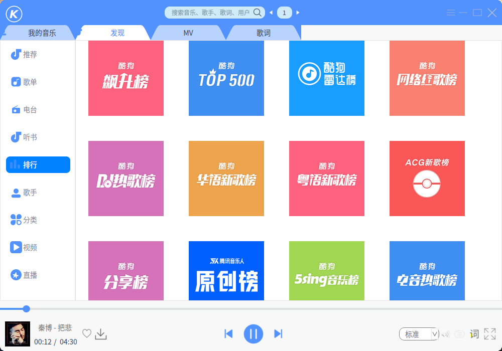
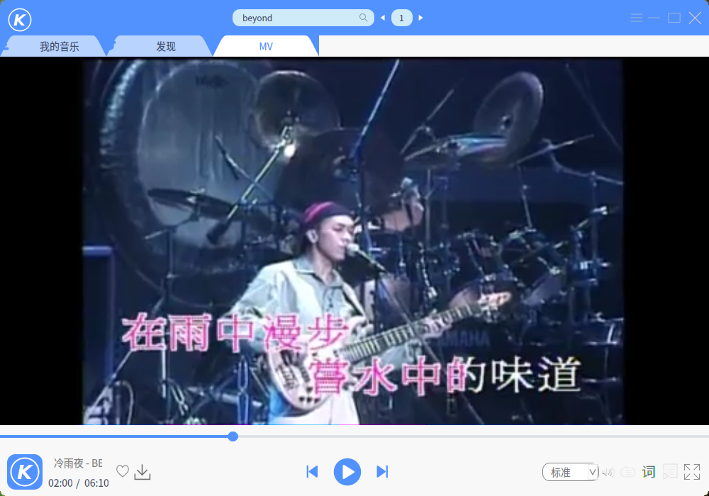

# Qt: 酷狗音乐
一款基于 Qt5 的酷狗音乐播放器，已编译好的 KuGou 适用于 Linux 64 位 Qt5.11 环境。  
软件界面和音乐版权归酷狗所有。  
  
  
  
### 运行依赖
```
sudo apt install libqt5multimedia5
```
### 编译依赖
```
sudo apt install qtmultimedia5-dev
```
### DEB打包
```
sudo dpkg -b deb/ KuGou-linux-amd64.deb
```
### V 2.0
参照酷狗9175重做。

### 参考
界面：酷狗音乐  
API：https://github.com/ecitlm/Kugou-api  
QTableWidget单元格放入按钮和点击返回行号：https://www.cnblogs.com/xuhui24/p/6555761.html  