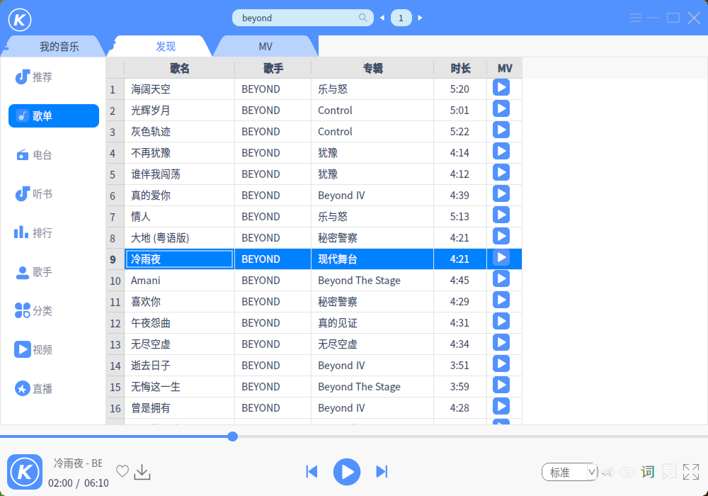

# Qt: 酷狗音乐
一款基于 Qt5.6 的酷狗音乐播放器，已编译好的 KuGou 适用于 Linux 64 位 Qt 5.6 环境。  
已完成功能：搜索播放歌曲、MV，歌词。  
软件界面和音乐版权归酷狗所有。  

  

  

  

### 参考
界面：酷狗音乐  
API：https://github.com/ecitlm/Kugou-api  
QTableWidget单元格放入按钮和点击返回行号：https://www.cnblogs.com/xuhui24/p/6555761.html  